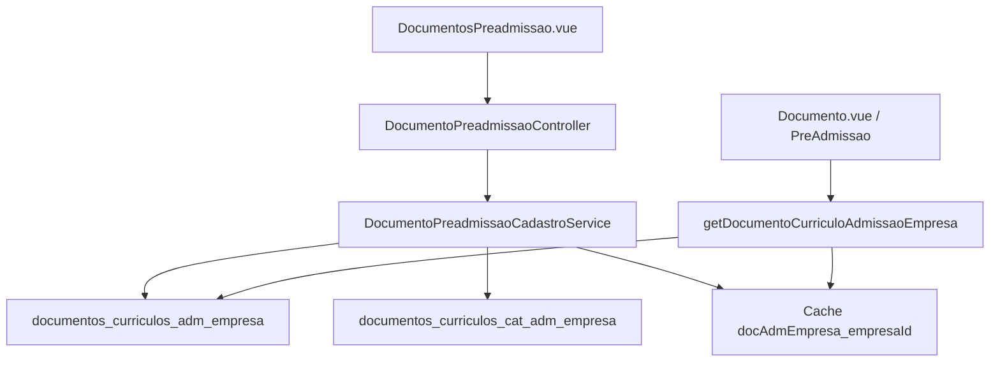

# Cadastro de Documentos da Pré-admissão — Design

**Spec**: `.specs/features/cadastro-documentos-preadmissao/spec.md`
**Status**: Approved (abordagem DossieTipos confirmada na spec)

---

## Architecture Overview

Mesmo recorte do cadastro de Tipos de Dossiê: **controller fino + service de domínio + Vue SFC** no padrão `FiltroListagem` + cards `mybp-*`. Sem catálogo global: toda leitura/escrita filtra `empresa_id` do usuário.



Abordagens descartadas: controller gordo (cadastros antigos — difícil de testar) e dois resources (tela de categorias — fora do escopo).

---

## Code Reuse Analysis

### Existing Components to Leverage

| Component | Location | How to Use |
| --- | --- | --- |
| DossieTipos UI | `resources/js/components/cadastros/dossietipos/DossieTipos.vue` | Copiar estrutura FiltroListagem, cards, modal, query params, bt-ativo |
| DossieTipoController | `app/Http/Controllers/DossieTipoController.php` | Mesmo contrato JSON (atualizar/store/edit/update/ativaDesativa) |
| Geração de identificadores | `DossieTipoCadastroService::gerarChaveDoLabel()` | Replicar ASCII + snake; aqui `tipo` = snake e `metodo` = Studly |
| TinyMCE | `tiny-mce-editor` global, preset `simples` | Descrição; override com plugin `link` (seeder já usa `<a>`) |
| listagemQueryParams | `resources/js/utils/listagemQueryParams.js` | Filtros + page/pages na URL |
| Habilidades seeder | `database/seeders/HabilidadesTableSeeder.php` | Tríade + papel 1 (Suporte) já anexa todas |
| Sanitização HTML | `AniversarianteMensagemRenderer` / `OcorrenciaController` | `strip_tags` com tags permitidas, incluindo `<a>` |

### Integration Points

| System | Integration Method |
| --- | --- |
| Pré-admissão candidato | `DocumentosCurriculosAdmissaoEmpresa::getDocumentoCurriculoAdmissaoEmpresa()` |
| Anexos | `documentos_curriculos.tipo` = `documentos_curriculos_adm_empresa.tipo` |
| Menu Cadastro | `resources/views/layouts/menu.blade.php` + `Sistema::permitirLinks` |
| Gates | `CarregaHabilidades` define Gate por nome da habilidade |

---

## Components

### DocumentoPreadmissaoCadastroService

- **Purpose**: Regras de listagem, CRUD, categoria find-or-create, identificadores, flags e cache.
- **Location**: `app/Services/Preadmissao/DocumentoPreadmissaoCadastroService.php`
- **Interfaces**:
  - `listar(int $empresaId, array $filtros, int $porPagina, int $page): LengthAwarePaginator`
  - `listarCategorias(int $empresaId): Collection` — combobox filtro/modal
  - `buscarParaEdicao(int $id, int $empresaId): DocumentosCurriculosAdmissaoEmpresa`
  - `criar(array $dados, int $empresaId): DocumentosCurriculosAdmissaoEmpresa`
  - `atualizar(int $id, array $dados, int $empresaId): DocumentosCurriculosAdmissaoEmpresa`
  - `alternarAtivo(int $id, int $empresaId): DocumentosCurriculosAdmissaoEmpresa`
- **Dependencies**: models de documento/categoria, `Cache`, `DB::transaction`, `Str`
- **Reuses**: padrão DossieTipoCadastroService (sem merge global)

### DocumentoPreadmissaoController

- **Purpose**: Autorizar, validar request, orquestrar o service, JSON no contrato dos cadastros.
- **Location**: `app/Http/Controllers/DocumentoPreadmissaoController.php`
- **Interfaces**: `index`, `atualizar`, `store`, `edit`, `update`, `ativaDesativa`
- **Dependencies**: service, `authorize('cadastro_documentos_preadmissao*')`
- **Reuses**: `DossieTipoController`

### DocumentosPreadmissao.vue

- **Purpose**: Tela de cadastro (listagem + modal).
- **Location**: `resources/js/components/cadastros/documentospreadmissao/DocumentosPreadmissao.vue`
- **Dependencies**: FiltroListagem, ComboboxAutoComplete, tiny-mce-editor, bt-ativo, ControlePaginacao
- **Reuses**: DossieTipos.vue (`script setup`)

### Wiring

- Blade: `resources/views/g/cadastros/documentospreadmissao/index.blade.php`
- App: `resources/js/g/cadastros/documentospreadmissao/app.js`
- Mix: `webpack.mix.js` → `public/js/g/documentospreadmissao/`
- Rotas: `routes/web.php` grupo `prefix cadastro`, `as documentospreadmissao.`
- Path: `/g/cadastro/documentos-preadmissao`

---

## Data Models

### DocumentosCurriculosCatAdmissaoEmpresa

Corrigir `$table` para `documentos_curriculos_cat_adm_empresa`. `$timestamps = false`. Relação `hasMany` documentos.

```
id, empresa_id, label, ativo
```

### DocumentosCurriculosAdmissaoEmpresa

`$timestamps = false`. `belongsTo` categoria. Constante de cache + `limparCache($empresaId)`. Getter **não** dá forget na leitura.

```
id, empresa_id, categoria_id, label, metodo, descricao, tipo,
url_arquivo, configuracoes (json), ordem, ativo
```

### Payload do formulário

```
label: string
descricao: string|null          // HTML sanitizado
categoria_id: int|null          // existente da empresa
categoria_nova: string|null     // se preenchido, find-or-create na empresa
ordem: int
ativo: bool
configuracoes: {
  obrigatorio, apenas_img, apenas_pdf, apenas_pdf_img,
  multiple, min, max, sogestao
}
```

`tipo` e `metodo` **nunca** vêm do cliente: gerados no create; ignorados no update.

### Identificadores

- `tipo` = `gerarChaveDoLabel(label)` (snake, ASCII)
- `metodo` = `Str::studly(tipo)`
- Unicidade: `tipo` único por `empresa_id`

### Flags de arquivo

Mutuamente exclusivas: no máximo um de `apenas_img` | `apenas_pdf` | `apenas_pdf_img`. UI: combobox “Tipo de arquivo aceito” (`qualquer` / `imagem` / `pdf` / `pdf_imagem`) mapeado para os três booleanos. `min` ≥ 1; se `!multiple` então `max` = `min` (default 1); se `multiple` então `max` ≥ `min`.

### Categoria no modal

Combobox das categorias da empresa + campo “Nova categoria”. Se `categoria_nova` trim não vazio: localiza por label+empresa (case-insensitive) ou cria `ativo=true`. Senão exige `categoria_id` da empresa.

### Cache

Chave `docAdmEmpresa_{empresa_id}`, TTL 168h. Invalidar em criar/atualizar/alternarAtivo. Getter: `Cache::get` → query + `put` (remover o `forget` atual).

### HTML da descrição

`strip_tags` permitindo: `p br strong b em i u ul ol li a`. Persistido já sanitizado.

---

## Error Handling Strategy

| Error Scenario | Handling | User Impact |
| --- | --- | --- |
| Sem permissão | `authorize` / middleware `can` | 403 |
| Sem empresa_id | DomainException 400 | “Usuário sem empresa vinculada.” |
| Documento/categoria de outra empresa | 404 | “Documento não encontrado.” |
| tipo duplicado na empresa | 400 | “Já existe um documento com este nome.” |
| Flags de arquivo conflitantes / max < min | 400 | Mensagem de validação |
| Validação Form Request / Validator | 400 + `erros` | Destaque no modal |
| Exceção inesperada | log sem dado sensível, 400 genérico | “Houve um erro…” |

---

## Risks & Concerns

| Concern | Location | Impact | Mitigation |
| --- | --- | --- | --- |
| Model categoria aponta tabela errada | `DocumentosCurriculosCatAdmissaoEmpresa.php:59` | CRUD de categoria gravaria na tabela de documentos | Corrigir `$table` neste feature |
| Getter zera cache a cada leitura | `DocumentosCurriculosAdmissaoEmpresa.php:96-97` | Cache inútil; N+1 no transform da categoria | Parar o forget; eager load categoria; invalidar só em mutação |
| `first()->label` NPE se categoria nula | mesmo getter `:106` | 500 na pré-admissão | Null-safe + `Não informado` |
| `tipo` hardcoded em relações do Curriculo | `Curriculo.php` (~606+) | Documentos novos não entram nessas relações específicas | Fora de escopo; pré-admissão itera o catálogo por `tipo` dinâmico |
| TinyMCE `simples` sem plugin `link` | `tinymceSelfhost.js` | Cliente não recria links do seeder | Override `:init` com `link` nesta tela |
| Testes em SQLite :memory: sem migrations dessas tabelas | `tests/Feature/DossieTipoCadastroTest.php` | Precisa criar schema no setUp | Mesmo padrão do DossieTipo (Schema::create no teste) |

---

## Tech Decisions (only non-obvious ones)

| Decision | Choice | Rationale |
| --- | --- | --- |
| `tipo` = snake, `metodo` = Studly | Invertido em relação ao dossiê | Casa com o seeder (`foto3x4` / `FotoTres`) e com `documentos_curriculos.tipo` |
| Paginação no banco | Eloquent `paginate` | Sem merge global; evita carregar tudo em memória |
| Combobox único p/ tipo de arquivo | Em vez de 3 switches | Garante exclusão mútua na UI |
| Sem Form Request dedicado | Validator no controller, como DossieTipo | Consistência do cadastro recém-feito |
