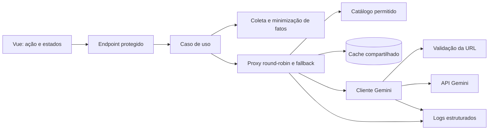
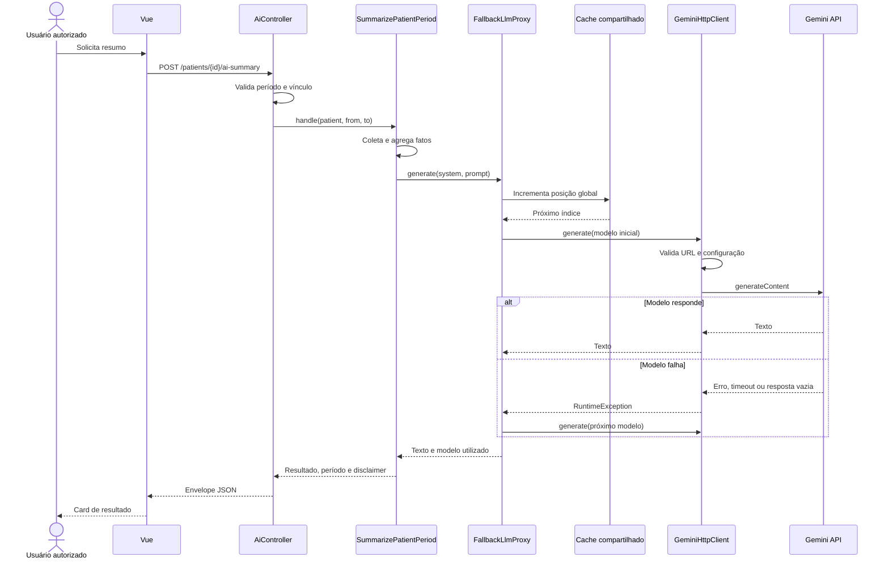

# Arquitetura portável de geração de conteúdo com IA

Este documento descreve a implementação de IA do ComCardio e separa os
elementos específicos do produto dos componentes que você pode reutilizar em
outros sistemas.

O caso de uso atual gera um resumo operacional de um período de acompanhamento.
O usuário não escolhe o modelo. Um proxy distribui as requisições entre modelos
Gemini e tenta os demais quando o modelo inicial falha.

## Escopo atual

A implementação atual oferece:

- Geração síncrona de texto por uma API Laravel.
- Seleção de modelos controlada no servidor.
- Distribuição round-robin entre modelos configurados.
- Fallback circular quando um modelo falha.
- Um único provedor, o Google Gemini.
- Uma única chave de API e uma lista de modelos.
- Autorização por papel e vínculo com o recurso consultado.
- Minimização dos dados enviados ao provedor.
- Proteção contra SSRF na URL de saída.
- Rate limit, logs estruturados e testes de regressão.
- Estados de carregamento, erro e sucesso no Vue.

Esta implementação não oferece, neste momento:

- Distribuição entre Gemini, Groq, OpenAI, Anthropic ou outros provedores.
- Rotação entre várias chaves ou contas do mesmo provedor.
- Circuit breaker, cooldown ou pontuação de saúde por modelo.
- Retry com backoff no mesmo modelo.
- Classificação detalhada entre erros transitórios e permanentes.
- Persistência, versionamento ou aprovação do texto gerado.
- Saída estruturada por JSON Schema.
- Processamento assíncrono por fila.

## Visão arquitetural



As dependências apontam do caso de uso para contratos do domínio. Os detalhes
de HTTP, cache e provedor ficam na infraestrutura.

## Responsabilidades por camada

| Camada | Componente | Responsabilidade |
| --- | --- | --- |
| HTTP | `AiController` | Validar entrada, autorizar, mapear erros e responder. |
| Aplicação | `SummarizePatientPeriod` | Coletar fatos, montar prompts e devolver o resultado. |
| Domínio | `LlmProxy` | Definir o contrato usado pelo caso de uso. |
| Domínio | `LlmClient` | Definir o contrato mínimo de um cliente de modelo. |
| Domínio | `GeminiModelCatalog` | Mapear aliases internos para IDs permitidos. |
| Infraestrutura | `FallbackLlmProxy` | Aplicar round-robin e fallback. |
| Infraestrutura | `GeminiHttpClient` | Implementar o protocolo HTTP do Gemini. |
| Segurança | `SafeOutboundUrl` | Restringir esquema, host, DNS e redes privadas. |
| Observabilidade | `AppLog` | Registrar eventos sem incluir chaves sensíveis. |
| Apresentação | `AiSummaryCard` | Representar loading, erro, resultado e disclaimer. |

## Fluxo completo



## Contratos do domínio

O caso de uso não depende diretamente do Gemini. Ele depende de `LlmProxy`:

```php
interface LlmProxy
{
    public function isConfigured(): bool;

    /** @return array{text: string, model: string, model_id: string} */
    public function generate(string $system, string $prompt): array;
}
```

O proxy usa um cliente mais simples:

```php
interface LlmClient
{
    public function isConfigured(): bool;

    public function generate(
        string $modelId,
        string $system,
        string $prompt,
    ): string;
}
```

Essa separação permite trocar a política de roteamento sem alterar o caso de
uso e trocar o protocolo HTTP sem colocar detalhes do provedor no domínio.

No container Laravel, os contratos são associados às implementações:

```php
$this->app->bind(LlmClient::class, GeminiHttpClient::class);
$this->app->bind(LlmProxy::class, FallbackLlmProxy::class);
```

## Catálogo de modelos

O frontend não recebe nem escolhe modelos. O servidor usa aliases internos para
impedir que um valor arbitrário chegue à URL do provedor.

Exemplo conceitual:

```php
private const CATALOG = [
    'fast' => [
        'id' => 'provider-fast-model',
        'label' => 'Fast model',
    ],
    'quality' => [
        'id' => 'provider-quality-model',
        'label' => 'Quality model',
    ],
];
```

Na implementação atual, `GeminiModelCatalog`:

1. Recebe aliases configurados em `GEMINI_MODELS`.
2. Remove aliases que não estão no catálogo.
3. Move `GEMINI_MODEL` para o início quando ele está permitido.
4. Resolve cada alias para o ID real usado pelo Gemini.

Confirme a disponibilidade dos IDs na documentação do provedor antes de copiar
o catálogo para outro produto. O catálogo local não consulta o provedor.

## Round-robin e fallback

O proxy usa a chave de cache global `ai:proxy:model-rotation`.

Para `N` modelos, cada requisição calcula:

```text
posição = (contador_atômico - 1) mod N
```

Depois, o proxy rotaciona a lista. Com três modelos, a ordem inicial muda assim:

```text
Requisição 1: A → B → C
Requisição 2: B → C → A
Requisição 3: C → A → B
Requisição 4: A → B → C
```

O primeiro item distribui o uso. Os itens seguintes formam a cadeia de fallback.
O proxy devolve o primeiro resultado válido.

```text
para cada modelo na lista rotacionada:
    tente gerar
    se funcionar, devolva texto e modelo
    se ocorrer falha operacional, registre e continue

se todos falharem:
    devolva erro de indisponibilidade
```

### Requisito operacional do cache

Use um cache compartilhado com incremento atômico, como Redis, quando houver
mais de uma instância da aplicação. Um cache local por processo cria rotações
independentes e não distribui o tráfego globalmente.

O contador atual não tem expiração. Isso é adequado para um contador modular,
mas você pode aplicar expiração ou particionar a chave por produto, tenant,
provedor ou finalidade.

### Limitação de free tier

Round-robin entre modelos não garante multiplicação da cota gratuita. O
provedor pode aplicar limites por projeto, conta, chave, modelo ou combinação
desses elementos. Consulte as regras do provedor.

Na implementação atual, todos os modelos usam a mesma chave Gemini. Portanto, o
proxy distribui carga e contorna falhas específicas de modelo, mas não cria cotas
independentes.

## Cliente do provedor

`GeminiHttpClient` executa uma chamada síncrona para:

```text
POST https://generativelanguage.googleapis.com/
     v1beta/models/{modelId}:generateContent
```

Configuração atual da geração:

```json
{
  "generationConfig": {
    "temperature": 0.2,
    "maxOutputTokens": 512
  }
}
```

A temperatura baixa reduz variação em resumos factuais. O limite de tokens
controla custo, latência e tamanho da resposta.

O cliente considera falha quando:

- A chave não está configurada.
- A validação da URL bloqueia o destino.
- A conexão falha ou excede o timeout de 20 segundos.
- O provedor retorna um status HTTP fora da faixa de sucesso.
- A resposta não contém texto em
  `candidates.0.content.parts.0.text`.

O cliente converte falhas operacionais em `RuntimeException`. O proxy captura
essa categoria e tenta o próximo modelo.

## Construção do prompt

O caso de uso separa instruções de sistema e fatos do usuário.

### Instrução de sistema atual

A instrução exige que o modelo:

- Escreva em português do Brasil.
- Produza entre quatro e oito frases.
- Informe o período analisado.
- Não faça diagnóstico.
- Não sugira medicamentos.
- Não altere o plano de cuidado.
- Não invente números.
- Declare quando faltarem dados.
- Identifique o texto como automatizado.

### Fatos enviados

O prompt do usuário é um JSON com esta forma:

```json
{
  "period": {
    "from": "2026-08-03",
    "to": "2026-09-01"
  },
  "generated_at": "2026-09-01T20:00:00-03:00",
  "occurrence_count": 54,
  "adherence_percent": 38.89,
  "adherence_by_type": {
    "medication": 50,
    "exercise": 26.67,
    "hydration": 31.25
  },
  "events": [
    {
      "name": "cansaço",
      "count": 2
    }
  ]
}
```

O sistema não envia nome, idade, telefone, e-mail, notas de atividades ou texto
livre das observações. Ele envia nomes e contagens de eventos, que ainda podem
ser dados de saúde e devem receber proteção adequada.

O caso de uso também não envia o resultado completo do relatório. Ele reconstrói
um conjunto mínimo e previsível de fatos.

## Contrato HTTP

### Requisição

```http
POST /api/v1/patients/{publicId}/ai-summary
Content-Type: application/json

{
  "from": "2026-08-03",
  "to": "2026-09-01"
}
```

`from` e `to` são opcionais. O endpoint valida datas e exige que `to` não seja
anterior a `from` quando ambos são enviados.

### Resposta de sucesso

```json
{
  "success": true,
  "data": {
    "text": "Resumo automatizado...",
    "model": "flash-lite",
    "model_id": "gemini-2.5-flash-lite",
    "period": {
      "from": "2026-08-03",
      "to": "2026-09-01"
    },
    "disclaimer": "Resumo automatizado a partir dos registros do período. Não é diagnóstico e não altera o plano de cuidado."
  }
}
```

### Respostas de erro

| Status | Situação |
| --- | --- |
| `401` | Sessão ou token ausente. |
| `403` | Papel sem acesso à rota. |
| `404` | Paciente inexistente ou não vinculado ao médico. |
| `422` | Período inválido. |
| `503` | IA sem configuração. |
| `502` | Provedor indisponível ou nenhum modelo respondeu. |

O endpoint possui limite de 10 requisições por minuto em produção e 60 por
minuto em ambiente local.

## Autorização e isolamento

A autorização acontece em duas etapas:

1. O grupo de rotas exige o papel `doctor`.
2. `LinkedPatient::ofDoctor()` confirma o vínculo entre médico e paciente.

O frontend não é uma fronteira de segurança. Ele apenas melhora a experiência.
A API sempre valida o papel e o vínculo antes de consultar dados ou chamar o
provedor.

## Segurança de saída

Antes da requisição externa, `SafeOutboundUrl` aplica estas regras:

- Aceita somente HTTP ou HTTPS.
- Exige HTTPS para a integração de IA.
- Bloqueia localhost e domínios internos conhecidos.
- Bloqueia IPs privados e reservados.
- Exige host presente em uma allowlist.
- Em produção, resolve DNS e rejeita endereços privados.

A allowlist atual contém somente:

```env
GEMINI_ALLOWED_HOSTS=generativelanguage.googleapis.com
```

Não aceite uma URL de provedor enviada pelo frontend. Monte URLs usando catálogo
e configuração controlados pelo servidor.

## Configuração

```env
GEMINI_API_KEY=
GEMINI_MODEL=flash
GEMINI_MODELS=flash,flash-lite,pro
GEMINI_ALLOWED_HOSTS=generativelanguage.googleapis.com
```

| Variável | Uso |
| --- | --- |
| `GEMINI_API_KEY` | Credencial enviada no header `x-goog-api-key`. |
| `GEMINI_MODEL` | Modelo preferido no primeiro ciclo. |
| `GEMINI_MODELS` | Participantes e ordem base da rotação. |
| `GEMINI_ALLOWED_HOSTS` | Destinos HTTPS permitidos. |

Nunca exponha a chave no bundle frontend, no contrato HTTP ou em logs.

## Observabilidade

O cliente e o proxy registram eventos estruturados:

| Evento | Significado |
| --- | --- |
| `ai.gemini.ok` | O modelo devolveu texto. |
| `ai.gemini.failed` | O transporte falhou. |
| `ai.gemini.rejected` | O provedor devolveu status sem sucesso. |
| `ai.gemini.blocked_url` | A proteção de saída bloqueou a URL. |
| `ai.proxy.model_failed` | O proxy seguirá para outro modelo. |

Os eventos incluem `model_id`, status HTTP quando disponível, IDs de requisição
e correlação, ambiente e usuário autenticado.

`AppLog` remove chaves sensíveis conhecidas. O código não registra prompt,
resposta, chave da API, corpo HTTP, e-mail ou telefone.

Para outro produto, adicione métricas que não contenham conteúdo do usuário:

- Contagem de chamadas por provedor e modelo.
- Latência por tentativa e latência total.
- Taxa de fallback.
- Taxa de erro por categoria.
- Tokens de entrada e saída, quando o provedor informar.
- Custo estimado.
- Circuitos abertos e modelos em cooldown.

## Experiência frontend

As telas não exibem seletor de modelo. O servidor controla o roteamento.

O fluxo Vue mantém quatro estados:

```text
idle → loading → success
               ↘ error
```

`AiSummaryCard` representa:

- Loading com mensagem de análise.
- Erro com `role="alert"`.
- Resultado com identificação de conteúdo automatizado.
- Metadados com período e disclaimer.
- Região `aria-live` para anunciar mudanças.

Ao trocar paciente ou período, a tela limpa o resultado anterior para impedir
que um texto antigo pareça pertencer ao novo contexto.

## Estratégia de testes

`PatientAiSummaryTest` cobre os comportamentos críticos:

- O primeiro modelo falha com HTTP 503 e o segundo conclui.
- Requisições sucessivas começam por modelos diferentes.
- A API retorna 503 sem chave configurada.
- Um médico não acessa o paciente de outro médico.
- O prompt contém nomes agregados de eventos.
- O prompt não contém notas livres do paciente.

Use `Http::fake()` para impedir chamadas reais ao provedor. Limpe a chave de
rotação no cache antes de cada cenário que dependa da ordem.

Uma suíte portável também deve testar:

- Timeout e erro de conexão.
- Resposta vazia.
- Todos os modelos indisponíveis.
- URL fora da allowlist.
- Chave inválida sem fallback desnecessário.
- Rate limit do provedor.
- Concorrência no contador round-robin.
- Conteúdo longo e caracteres Unicode.
- Ausência de dados.
- Redação de dados sensíveis nos logs.

## Blueprint para reutilização

Use esta sequência para levar a solução a outro produto.

1. Defina o caso de uso e o risco da saída.
2. Crie um objeto de fatos mínimo, sem passar entidades completas.
3. Separe instruções de sistema dos dados serializados.
4. Defina um contrato de gateway independente do provedor.
5. Crie um catálogo controlado pelo servidor.
6. Implemente um cliente por protocolo de provedor.
7. Implemente a política de roteamento no proxy.
8. Use cache compartilhado e atômico.
9. Classifique erros antes de decidir por fallback.
10. Proteja URLs externas com HTTPS e allowlist.
11. Autorize o recurso antes de montar o prompt.
12. Adicione rate limit, timeout e limite de saída.
13. Registre metadados, nunca prompts ou respostas por padrão.
14. Exiba disclaimer e estados claros no frontend.
15. Teste fallback sem chamar serviços externos.

### Estrutura de diretórios sugerida

```text
Domain/
  Ai/
    AiGateway
    ProviderClient
    GenerationResult
    ModelEndpoint
    Exceptions/
Application/
  UseCases/
    GenerateProductSummary
Infrastructure/
  Ai/
    RoutingAiGateway
    Providers/
      GeminiClient
      GroqClient
      OpenAiClient
Http/
  Controllers/
    AiController
```

## Evolução para multiprovedor

Para distribuir entre free tiers de provedores diferentes, substitua o catálogo
de modelos por um catálogo de endpoints:

```php
final readonly class ModelEndpoint
{
    public function __construct(
        public string $key,
        public string $provider,
        public string $modelId,
        public int $priority,
    ) {}
}
```

Defina um cliente por provedor:

```php
interface ProviderClient
{
    public function provider(): string;

    public function isConfigured(): bool;

    public function generate(
        ModelEndpoint $endpoint,
        GenerationRequest $request,
    ): GenerationResult;
}
```

O gateway seleciona o cliente por `provider` e mantém a política fora dos
clientes:

```text
RoutingAiGateway
  ├── RoutingPolicy
  ├── HealthStore
  ├── GeminiClient
  ├── GroqClient
  └── OpenAiClient
```

### Classifique erros

Não aplique fallback a qualquer erro. Use categorias explícitas:

| Categoria | Comportamento recomendado |
| --- | --- |
| Rate limit | Coloque endpoint em cooldown e tente outro. |
| Timeout ou conexão | Tente outro endpoint. |
| HTTP 5xx | Tente outro endpoint. |
| Resposta vazia ou inválida | Registre e tente outro. |
| Chave inválida | Interrompa esse provedor e alerte operação. |
| Entrada inválida | Falhe sem tentar outros modelos. |
| Bloqueio de segurança | Falhe imediatamente. |
| Conteúdo recusado por política | Trate conforme a regra do produto. |

### Adicione cooldown e circuit breaker

Round-robin puro volta a um modelo limitado em todas as voltas. Um proxy mais
robusto registra no cache:

```text
ai:health:{provider}:{model}:failures
ai:health:{provider}:{model}:cooldown_until
ai:health:{provider}:{model}:last_success
```

Quando o provedor retorna rate limit, o gateway ignora o endpoint até o fim do
cooldown. Depois, permite uma tentativa de recuperação.

### Preserve uma saída comum

Normalize respostas diferentes em um contrato único:

```php
final readonly class GenerationResult
{
    public function __construct(
        public string $text,
        public string $provider,
        public string $model,
        public ?int $inputTokens,
        public ?int $outputTokens,
        public int $attempts,
    ) {}
}
```

O caso de uso não precisa conhecer os formatos de Gemini, Groq ou OpenAI.

## Decisões que dependem do produto

Não copie estas decisões sem avaliar o novo contexto:

- Idioma, tom e tamanho da resposta.
- Dados permitidos no prompt.
- Necessidade de consentimento ou base legal.
- Retenção de prompts e respostas.
- Aprovação humana antes de publicar ou executar ações.
- Modelos permitidos e regiões de processamento.
- Timeout e limite de tokens.
- Processamento síncrono ou por fila.
- Estratégia de cache por tenant.
- Disclaimer e linguagem de risco.

Para saúde, finanças, jurídico ou decisões com efeito material, mantenha revisão
humana e proíba ações autônomas baseadas somente na saída do modelo.

## Limitações conhecidas da implementação atual

- O proxy trata todas as `RuntimeException` como falhas recuperáveis. Uma chave
  inválida pode causar tentativas redundantes em todos os modelos.
- Não existe cooldown após rate limit.
- O contador de rotação é global para todos os usuários e finalidades.
- O endpoint direto usa `now()->subDays(30)` como início padrão. Como as duas
  datas são inclusivas, isso representa 31 datas. A tela de relatório envia um
  intervalo explícito de 30 dias e não sofre essa diferença.
- A resposta é aceita quando contém texto não vazio, sem validação estrutural.
- O resumo não é persistido nem associado a versão de prompt.
- O carregamento de atividades inclui título, embora o objeto de fatos atual use
  somente tipo e status.
- O catálogo é estático e pode ficar desatualizado em relação ao provedor.

Essas limitações não impedem o uso atual, mas devem entrar no plano antes de
transformar o componente em uma plataforma de IA compartilhada.

## Referências no código

- `apps/api/app/Domain/Ai/LlmProxy.php`
- `apps/api/app/Domain/Ai/LlmClient.php`
- `apps/api/app/Domain/Ai/GeminiModelCatalog.php`
- `apps/api/app/Domain/UseCases/SummarizePatientPeriod.php`
- `apps/api/app/Infrastructure/Ai/FallbackLlmProxy.php`
- `apps/api/app/Infrastructure/Ai/GeminiHttpClient.php`
- `apps/api/app/Domain/Support/SafeOutboundUrl.php`
- `apps/api/app/Http/Controllers/Api/V1/AiController.php`
- `apps/api/app/Providers/AppServiceProvider.php`
- `apps/api/tests/Feature/Api/V1/PatientAiSummaryTest.php`
- `apps/web/src/components/AiSummaryCard.vue`
- `apps/web/src/pages/PacienteFicha.vue`
- `apps/web/src/pages/Relatorio.vue`
